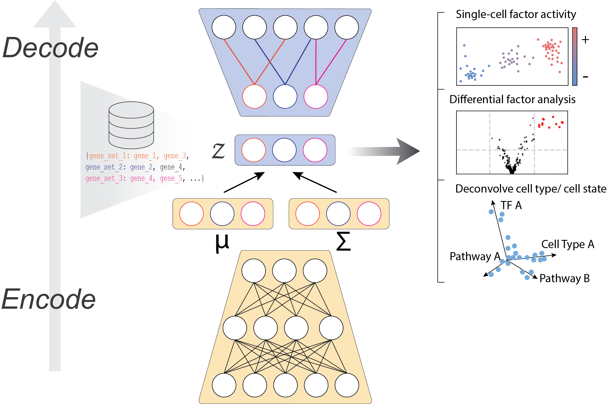

.. vega documentation master file, created by
   sphinx-quickstart on Fri Feb  5 20:46:35 2021.
   You can adapt this file completely to your liking, but it should at least
   contain the root `toctree` directive.

VEGA: VAE Enhanced by Gene Annotations
======================================

VEGA is a deep generative model for scRNA-Seq data whose decoder structure is informed by gene modules such as pathways, gene regulatory networks, or cell type marker sets. It allows embedding of single-cell data into an interpretable latent space, inference of gene module activity at the single-cell level, and differential activity testing for those gene modules between groups of cells. VEGA is implemented in Pytorch and works around the `Scanpy <https://scanpy.readthedocs.io/en/stable/index.html>`_ ecosystem.

Getting started
---------------
VEGA simply requires an Anndata single-cell dataset and  GMT file(s) with the gene module membership, such as provided by databases like MSigDB. A tutorial for using VEGA is provided `here <https://github.com/LucasESBS/vega/blob/main/tutorials/Vega-tutorial.ipynb>`_.

Note: We recommend to preprocess the single-cell dataset before passing it to VEGA. 

.. toctree::
    
    Installation <installation.rst>
    API <api/index.rst>

