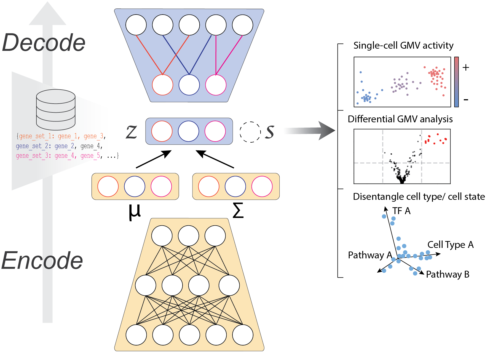

.. vega documentation master file, created by
   sphinx-quickstart on Fri Feb  5 20:46:35 2021.
   You can adapt this file completely to your liking, but it should at least
   contain the root `toctree` directive.

VEGA documentation
==================

VEGA is a deep generative model for scRNA-Seq data whose decoder structure is informed by gene modules such as pathways, gene regulatory networks, or cell type marker sets. It allows embedding of single-cell data into an interpretable latent space, inference of gene module activity at the single-cell level, and differential activity testing for those gene modules between groups of cells. VEGA is implemented in Pytorch and works around the `scanpy <https://scanpy.readthedocs.io/en/stable/index.html>`_ and `scvi-tools <https://docs.scvi-tools.org/en/stable/index.html#>`_ ecosystems.

Getting started
---------------
VEGA simply requires 

* An Anndata single-cell dataset
* GMT file(s) with the gene module membership, such as provided by databases like `MSigDB <https://www.gsea-msigdb.org/gsea/index.jsp>`_

`Note: We recommend to preprocess the single-cell dataset before passing it to VEGA.`

Main features
-------------
VEGA provides the following features

* Embed single-cell data into an interpretable latent space
* Inference of gene module activities at the single-cell level
* Cell type / cell state disentanglement
* Alternative to enrichment methods for finding differentially activated pathways

.. card:: Differential pathway activity

    Inspired by the differential gene expression procedure from ``scvi-tools``, VEGA provides a Bayesian testing procedure to find significantly activated gene modules in your dataset. More information in the vega basic usage tutorial.

Navigate the docs
-----------------
.. toctree::
    
    Installation <installation.rst>
    API <api/index.rst>
    Tutorials <tutorials/index.rst>
    References <references.rst>
    GitHub <https://github.com/LucasESBS/vega>
